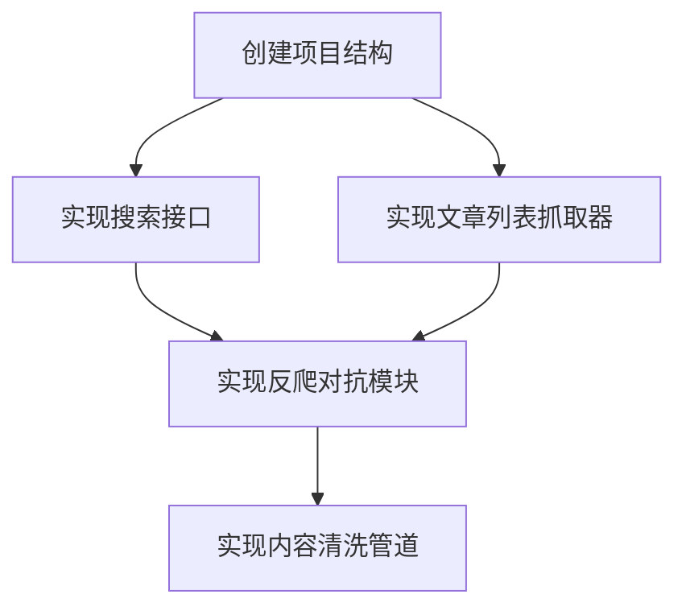
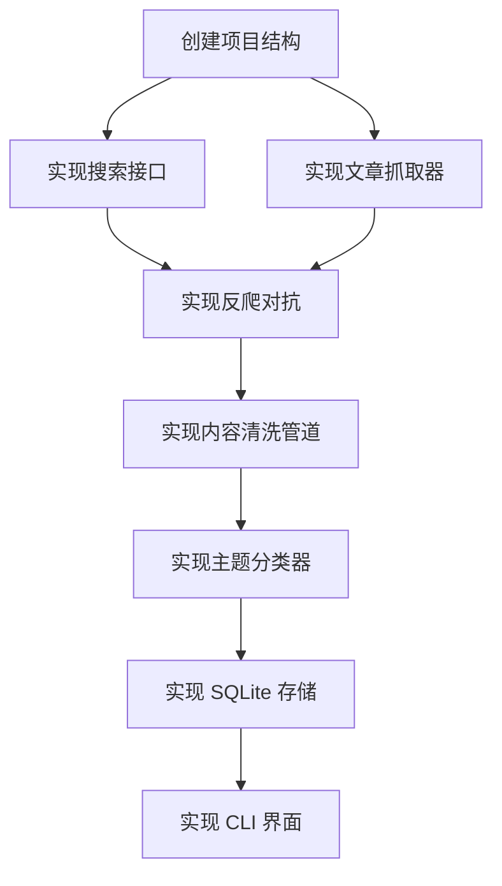

# Idea-to-Action Skill — 三层输出架构规范

> **版本**: 1.0
> **状态**: 规范定义
> **适用范围**: Idea-to-Action Skill 的所有输出产物

---

## 1. 背景与问题

当前 Skill 的输出存在以下结构性问题：

1. **execution-plan.md 身份混乱** —— 既包含人类可读的项目概览，又包含 AI 执行的 9 段式 Prompt，导致文件臃肿（950+ 行）且职责不清
2. **prompts.yaml 与 execution-plan.md 内容重复** —— 同一信息在两处维护，容易出现不一致
3. **缺少独立的面向人类的项目报告** —— 决策日志、进度追踪、预期效果等信息无处安放
4. **执行 Prompt 过长** —— 每个 Prompt 约 80-120 行，内联了所有上下文信息，AI 每次执行都要处理大量冗余内容

## 2. 新架构：三层分离

核心思路：**按受众分离，按需加载，消除重复**。

```
输出目录/
├── REPORT.md                  # 层级 2：报告层（人类阅读）
├── framework/                 # 层级 1：框架层（AI 引用）
│   ├── task-tree.yaml
│   ├── research.yaml
│   ├── benchmarks.yaml
│   └── dependency-graph.mermaid
└── prompts/                   # 层级 3：Prompt 层（AI 执行）
    ├── 1.1.1.md
    ├── 1.2.1.md
    └── ...
```

---

## 3. 层级 1：框架层（framework/）

**定位**：AI 执行时按需引用的结构化数据。AI 通过 Read 工具按需加载，不一次性全部读入。

```
framework/
├── task-tree.yaml            # 任务树（Step 1 产出）
├── research.yaml             # 研究结论（Step 2 产出）
├── benchmarks.yaml           # 验收标准（Step 3 产出）
└── dependency-graph.mermaid  # 依赖关系图
```

### 3.1 设计原则

| 原则 | 说明 |
|------|------|
| 机器可读 | 使用 YAML / 结构化格式，便于程序化解析 |
| 自包含 | 每个文件独立可理解，不依赖其他文件的隐含约定 |
| 按需加载 | AI 只在需要时读取特定文件，避免一次性加载全部内容 |
| 纯数据 | 不包含自然语言描述，只包含结构化数据 |

### 3.2 各文件职责

**task-tree.yaml** — 任务树

```yaml
project: "AI 驱动的技术博客聚合平台"
version: 1
tasks:
  "1.1.1":
    name: "创建项目目录结构"
    description: "初始化项目骨架，包含 src/tests/docs 目录及配置文件"
    batch: 1
    complexity: low
    dependencies: []
    estimated_lines: 50
  "1.2.1":
    name: "实现搜索接口"
    description: "基于 requests 封装搜索 API 调用，支持关键词和日期过滤"
    batch: 1
    complexity: medium
    dependencies: ["1.1.1"]
    estimated_lines: 120
```

**research.yaml** — 研究结论

```yaml
project: "AI 驱动的技术博客聚合平台"
research:
  "1.2.1":
    approach: "使用 requests + BeautifulSoup，配合 User-Agent 轮换"
    key_findings:
      - "Google 搜索结果页面结构稳定，可直接解析"
      - "需要处理动态加载内容，考虑使用 Selenium 作为降级方案"
    pitfalls:
      - "❌ 直接使用默认 User-Agent 会被封禁 → ✅ 使用真实浏览器 UA 列表轮换"
      - "⚠️ 搜索结果数量可能为 0，需要设置最小结果数阈值"
    decision_summary:
      - decision: "HTTP 库选择"
        chosen: "requests"
        rejected: ["httpx", "aiohttp"]
        reason: "项目为同步架构，requests 生态最成熟"
        trade_off: "牺牲了异步能力，但降低了复杂度"
```

**benchmarks.yaml** — 验收标准

```yaml
project: "AI 驱动的技术博客聚合平台"
benchmarks:
  "1.1.1":
    - id: "B-1.1.1-1"
      criterion: "项目目录包含 src/, tests/, docs/ 三个子目录"
      verification: "检查目录结构是否存在"
    - id: "B-1.1.1-2"
      criterion: "pyproject.toml 包含项目基本元信息"
      verification: "解析 toml 文件验证字段完整性"
  "1.2.1":
    - id: "B-1.2.1-1"
      criterion: "搜索接口能返回至少 5 条结果"
      verification: "使用测试关键词调用接口并验证返回数量"
    - id: "B-1.2.1-2"
      criterion: "请求失败时抛出自定义 SearchError 异常"
      verification: "模拟网络错误验证异常行为"
```

**dependency-graph.mermaid** — 依赖关系图



---

## 4. 层级 2：报告层（REPORT.md）

**定位**：一份 Markdown 文件，供人类快速了解项目全貌。包含决策日志、进度追踪、预期效果等人类关心的信息。

### 4.1 结构定义

```markdown
# {项目名称} — 项目报告

> **生成时间**: {ISO 8601}
> **状态**: 规划完成 | 执行中 | 已完成
> **总任务数**: {N} 个 MEU
> **执行批次**: {N} 批

---

## 1. 项目概览

### 1.1 原始想法

> "{用户的原始想法}"

### 1.2 目标

{一段话描述项目要达成的目标}

### 1.3 范围

**包含**：
- {包含的内容}

**不包含**：
- {不包含的内容}

---

## 2. 任务拆解

### 2.1 任务树概览

{Mermaid 或 ASCII 图展示任务树结构}

### 2.2 任务清单

| 批次 | MEU ID | 名称 | 描述 | 复杂度 | 状态 |
|------|--------|------|------|--------|------|
| 1 | 1.1.1 | 创建项目结构 | ... | low | ⬜ 待执行 |
| 1 | 1.2.1 | 实现搜索接口 | ... | medium | ⬜ 待执行 |
| ... | ... | ... | ... | ... | ... |

### 2.3 执行顺序

{批次列表，每批次包含可并行的任务}

---

## 3. 关键决策

| 决策 | 选择 | 放弃的方案 | 理由 | Trade-off |
|------|------|-----------|------|-----------|
| ... | ... | ... | ... | ... |

---

## 4. 已知风险

| 风险 | 严重度 | 影响任务 | 缓解方案 |
|------|--------|---------|---------|
| ... | ... | ... | ... |

---

## 5. 预期效果

完成后，项目应该能够：
1. {效果 1}
2. {效果 2}
3. {效果 3}

---

## 6. 开放问题

| 问题 | 影响级别 | 建议处理方式 | 状态 |
|------|---------|-------------|------|
| ... | ... | ... | ... |

---

## 7. 进度追踪

> 执行过程中更新此部分

### 已完成

- [x] MEU-1.1.1 创建项目结构 — 完成于 {时间}

### 进行中

- [ ] MEU-1.2.2 实现文章列表抓取器 — 开始于 {时间}

### 待执行

- [ ] MEU-1.3.1 实现反爬对抗模块
- [ ] ...
```

### 4.2 完整示例

```markdown
# AI 驱动的技术博客聚合平台 — 项目报告

> **生成时间**: 2026-04-30T10:30:00+08:00
> **状态**: 规划完成
> **总任务数**: 8 个 MEU
> **执行批次**: 3 批

---

## 1. 项目概览

### 1.1 原始想法

> "我想做一个工具，能自动搜索和聚合技术博客文章，按主题分类，帮我节省每天找技术资料的时间。"

### 1.2 目标

构建一个命令行工具，能够根据关键词自动搜索技术博客文章，抓取内容并按主题分类存储，支持增量更新和本地全文搜索。

### 1.3 范围

**包含**：
- 搜索引擎结果抓取（Google/Bing）
- 文章内容提取和清洗
- 基于关键词的简单主题分类
- 本地 SQLite 存储
- 命令行交互界面

**不包含**：
- Web UI 界面
- 自动定时执行（后续迭代）
- AI 摘要生成（后续迭代）

---

## 2. 任务拆解

### 2.1 任务树概览



### 2.2 任务清单

| 批次 | MEU ID | 名称 | 描述 | 复杂度 | 状态 |
|------|--------|------|------|--------|------|
| 1 | 1.1.1 | 创建项目结构 | 初始化项目骨架和配置 | low | ⬜ 待执行 |
| 1 | 1.2.1 | 实现搜索接口 | 封装搜索 API 调用 | medium | ⬜ 待执行 |
| 1 | 1.2.2 | 实现文章抓取器 | 抓取搜索结果中的文章页面 | medium | ⬜ 待执行 |
| 2 | 1.3.1 | 实现反爬对抗 | UA 轮换、代理、降级策略 | high | ⬜ 待执行 |
| 2 | 2.1.1 | 实现内容清洗管道 | HTML 清洗、正文提取 | medium | ⬜ 待执行 |
| 2 | 2.2.1 | 实现主题分类器 | 基于关键词的主题分类 | medium | ⬜ 待执行 |
| 3 | 3.1.1 | 实现 SQLite 存储 | 数据模型和 CRUD 操作 | low | ⬜ 待执行 |
| 3 | 3.2.1 | 实现 CLI 界面 | 命令行交互和结果展示 | medium | ⬜ 待执行 |

### 2.3 执行顺序

- **第 1 批**（可并行）: MEU-1.1.1, MEU-1.2.1, MEU-1.2.2
- **第 2 批**（可并行）: MEU-1.3.1, MEU-2.1.1, MEU-2.2.1
- **第 3 批**（可并行）: MEU-3.1.1, MEU-3.2.1

---

## 3. 关键决策

| 决策 | 选择 | 放弃的方案 | 理由 | Trade-off |
|------|------|-----------|------|-----------|
| HTTP 库 | requests | httpx, aiohttp | 同步架构，生态成熟 | 牺牲异步能力 |
| HTML 解析 | BeautifulSoup | lxml, parsel | API 简单，学习成本低 | 性能略低于 lxml |
| 数据库 | SQLite | PostgreSQL, MongoDB | 零配置，单文件部署 | 不支持高并发写入 |
| 分类方案 | 关键词匹配 | TF-IDF + SVM | 实现简单，无需训练数据 | 分类精度有限 |

---

## 4. 已知风险

| 风险 | 严重度 | 影响任务 | 缓解方案 |
|------|--------|---------|---------|
| 搜索引擎反爬升级 | 高 | 1.2.1, 1.3.1 | 多搜索引擎降级 + 缓存策略 |
| 文章页面结构多变 | 中 | 1.2.2, 2.1.1 | readability 算法 + 站点特定提取器 |
| 中文分词精度 | 低 | 2.2.1 | 使用 jieba 分词 + 自定义词典 |

---

## 5. 预期效果

完成后，项目应该能够：
1. 输入关键词后 30 秒内返回 10+ 篇相关技术文章
2. 文章内容清洗后保留 90% 以上的正文，广告和导航栏去除率 95% 以上
3. 主题分类准确率达到 70% 以上（基于关键词匹配方案）
4. 支持本地全文搜索，响应时间 < 100ms

---

## 6. 开放问题

| 问题 | 影响级别 | 建议处理方式 | 状态 |
|------|---------|-------------|------|
| 是否需要支持 RSS 订阅源 | 低 | 后续迭代考虑 | 待定 |
| 文章去重策略（相似内容合并） | 中 | 基于标题 + URL 去重 | 待定 |

---

## 7. 进度追踪

> 执行过程中更新此部分

### 已完成

（暂无）

### 进行中

（暂无）

### 待执行

- [ ] MEU-1.1.1 创建项目结构
- [ ] MEU-1.2.1 实现搜索接口
- [ ] MEU-1.2.2 实现文章抓取器
- [ ] MEU-1.3.1 实现反爬对抗
- [ ] MEU-2.1.1 实现内容清洗管道
- [ ] MEU-2.2.1 实现主题分类器
- [ ] MEU-3.1.1 实现 SQLite 存储
- [ ] MEU-3.2.1 实现 CLI 界面
```

---

## 5. 层级 3：Prompt 层（prompts/）

**定位**：每个 MEU 一个独立的 Prompt 文件，供 AI 执行时使用。核心设计原则：**Prompt 短小精悍，通过引用框架层获取上下文**。

### 5.1 目录结构

```
prompts/
├── 1.1.1.md                # MEU 1.1.1 的执行 Prompt
├── 1.2.1.md                # MEU 1.2.1 的执行 Prompt
├── 1.2.2.md                # MEU 1.2.2 的执行 Prompt
├── ...
└── 3.2.1.md                # 最后一个 MEU 的执行 Prompt
```

### 5.2 Prompt 文件结构

每个 Prompt 文件约 **50-80 行**（而非原来的 ~120 行），结构如下：

```markdown
# 执行: {MEU 名称}

## 背景

- **项目**: {项目名称}
- **批次**: 第 {N} 批次
- **前置产出**: {已完成的前置 MEU 及其关键产出，1-2 句话}

## 任务

{目标描述，2-3 句话}

## 上下文

> 读取以下文件获取详细上下文：
> - 任务定义: `framework/task-tree.yaml` → 节点 "{MEU ID}"
> - 研究结论: `framework/research.yaml` → 条目 "{MEU ID}"
> - 验收标准: `framework/benchmarks.yaml` → 条目 "{MEU ID}"

## 避坑要点

- ❌ {错误做法} → ✅ {正确做法}
- ⚠️ {边界情况}

## 决策

| 决策 | 选择 | 理由 |
|------|------|------|
| ... | ... | ... |

## 约束

- {约束条件列表}

## 产出

- {必须交付的文件}

## 验收

- [ ] {验收标准，引用 benchmarks.yaml 中的具体条目}
```

### 5.3 关键设计要点

1. **引用而非内联**：Prompt 不再内联完整的上下文信息，而是告诉 AI "去读 framework/ 下的哪个文件的哪个条目"。AI 通过 Read 工具按需加载。
2. **精简避坑要点**：从 research.yaml 的 `decision_summary` 和 `pitfalls` 中提取，只保留最关键的 3-5 条。
3. **验收标准引用**：引用 benchmarks.yaml 中的具体条目 ID，不重复列出完整标准文本。
4. **前置产出摘要**：只保留 1-2 句话的关键产出描述，详细内容通过 framework/ 获取。

### 5.4 完整示例

**prompts/1.1.1.md**（低复杂度任务）：

```markdown
# 执行: 创建项目目录结构

## 背景

- **项目**: AI 驱动的技术博客聚合平台
- **批次**: 第 1 批次
- **前置产出**: 无（首个任务）

## 任务

初始化 Python 项目骨架，创建标准目录结构（src/tests/docs）和基础配置文件（pyproject.toml、.gitignore），确保项目可以通过 pip install -e . 安装。

## 上下文

> 读取以下文件获取详细上下文：
> - 任务定义: `framework/task-tree.yaml` → 节点 "1.1.1"
> - 验收标准: `framework/benchmarks.yaml` → 条目 "1.1.1"

## 避坑要点

- ❌ 使用 `setup.py` → ✅ 使用 `pyproject.toml`（现代 Python 项目标准）
- ⚠️ 确保 tests/ 目录有独立的 conftest.py，即使当前为空

## 决策

| 决策 | 选择 | 理由 |
|------|------|------|
| 构建系统 | hatchling | 轻量级，无需额外构建依赖 |
| Python 版本 | >=3.11 | 使用 3.11+ 的结构模式匹配等特性 |

## 约束

- 不安装任何第三方依赖（仅标准库）
- pyproject.toml 必须包含项目名称、版本、作者信息
- 目录结构遵循 src layout

## 产出

- `pyproject.toml` — 项目配置
- `.gitignore` — Git 忽略规则
- `src/blog_aggregator/__init__.py` — 包入口
- `tests/__init__.py` — 测试包入口
- `tests/conftest.py` — pytest 配置（可为空）

## 验收

- [ ] B-1.1.1-1: 项目目录包含 src/, tests/, docs/ 三个子目录
- [ ] B-1.1.1-2: pyproject.toml 包含项目基本元信息
```

**prompts/1.2.1.md**（中等复杂度任务）：

```markdown
# 执行: 实现搜索接口

## 背景

- **项目**: AI 驱动的技术博客聚合平台
- **批次**: 第 1 批次
- **前置产出**: MEU-1.1.1 已创建项目骨架，src/blog_aggregator/ 包结构就绪

## 任务

基于 requests 封装搜索 API 调用模块，支持关键词搜索和日期范围过滤，返回结构化的搜索结果列表。

## 上下文

> 读取以下文件获取详细上下文：
> - 任务定义: `framework/task-tree.yaml` → 节点 "1.2.1"
> - 研究结论: `framework/research.yaml` → 条目 "1.2.1"
> - 验收标准: `framework/benchmarks.yaml` → 条目 "1.2.1"

## 避坑要点

- ❌ 使用默认 User-Agent → ✅ 从真实浏览器 UA 列表中随机选择
- ❌ 不处理空结果 → ✅ 设置最小结果数阈值，不足时抛出 SearchError
- ⚠️ Google 搜索页面结构可能变化，解析逻辑需有兜底方案

## 决策

| 决策 | 选择 | 理由 |
|------|------|------|
| HTTP 库 | requests | 同步架构，生态成熟 |
| 结果解析 | BeautifulSoup | API 简单，适合结构化 HTML 解析 |

## 约束

- 搜索结果数量默认 10 条，最大 50 条
- 请求间隔 >= 2 秒（礼貌爬虫）
- 自定义异常类放在 src/blog_aggregator/exceptions.py

## 产出

- `src/blog_aggregator/searcher.py` — 搜索接口实现
- `src/blog_aggregator/exceptions.py` — 自定义异常
- `tests/test_searcher.py` — 单元测试

## 验收

- [ ] B-1.2.1-1: 搜索接口能返回至少 5 条结果
- [ ] B-1.2.1-2: 请求失败时抛出自定义 SearchError 异常
```

---

## 6. 与旧架构的对比

| 维度 | 旧架构 | 新架构 |
|------|--------|--------|
| execution-plan.md | 950+ 行，混合人类+AI 内容 | 拆分为 REPORT.md（人类）+ prompts/（AI） |
| prompts.yaml | 重复 execution-plan.md 内容 | 删除，改为 prompts/ 目录下独立文件 |
| 每个 Prompt 长度 | ~120 行（内联所有上下文） | ~50-80 行（引用框架层） |
| 人类报告 | 无独立报告 | REPORT.md（决策日志 + 进度追踪 + 预期效果） |
| AI 上下文效率 | 低（重复加载相同信息） | 高（按需引用，不重复） |
| 维护成本 | 高（多处修改） | 低（单一数据源） |

---

## 7. 数据流

```
用户输入
    │
    ▼
Step 1: 任务拆解 ──→ framework/task-tree.yaml
    │
    ▼
Step 2: 研究 ──→ framework/research.yaml
    │
    ▼
Step 3: 验收标准 ──→ framework/benchmarks.yaml
    │
    ▼
Step 4: 生成输出
    ├── REPORT.md          ← 从 task-tree.yaml + research.yaml 提取人类可读信息
    ├── prompts/*.md       ← 从 task-tree.yaml + research.yaml + benchmarks.yaml 提取 AI 执行信息
    └── framework/dependency-graph.mermaid ← 从 task-tree.yaml 生成
    │
    ▼
Step 5: 执行 ──→ AI 读取 prompts/*.md，按需引用 framework/ 中的文件
    │
    ▼
执行结果 ──→ 更新 REPORT.md 中的进度追踪部分
```

---

## 8. 迁移指南

从旧架构迁移到新架构的步骤：

1. **删除** `prompts.yaml`（内容已合并到 prompts/ 目录）
2. **拆分** `execution-plan.md`：
   - 人类可读部分（项目概览、任务清单、决策、风险）→ 移入 REPORT.md
   - AI 执行 Prompt 部分 → 拆分为 prompts/ 下的独立文件
3. **提取** 结构化数据到 framework/：
   - 任务定义 → task-tree.yaml
   - 研究结论 → research.yaml
   - 验收标准 → benchmarks.yaml
4. **精简** 每个 Prompt 文件，将内联上下文替换为 framework/ 引用
